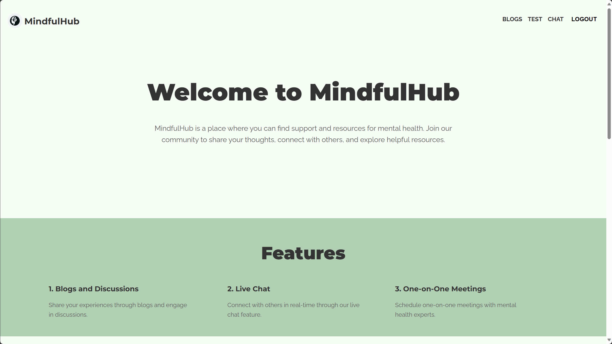
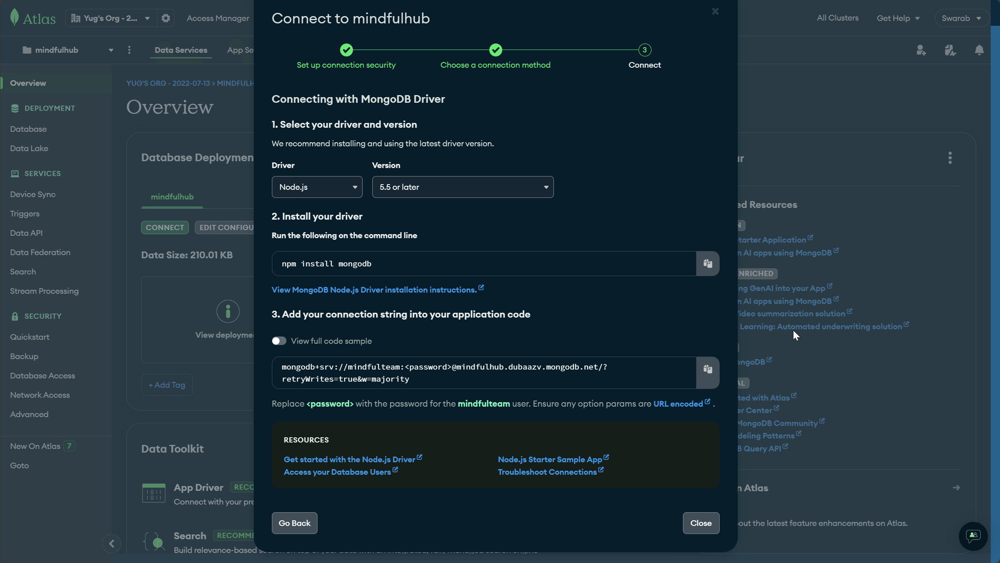
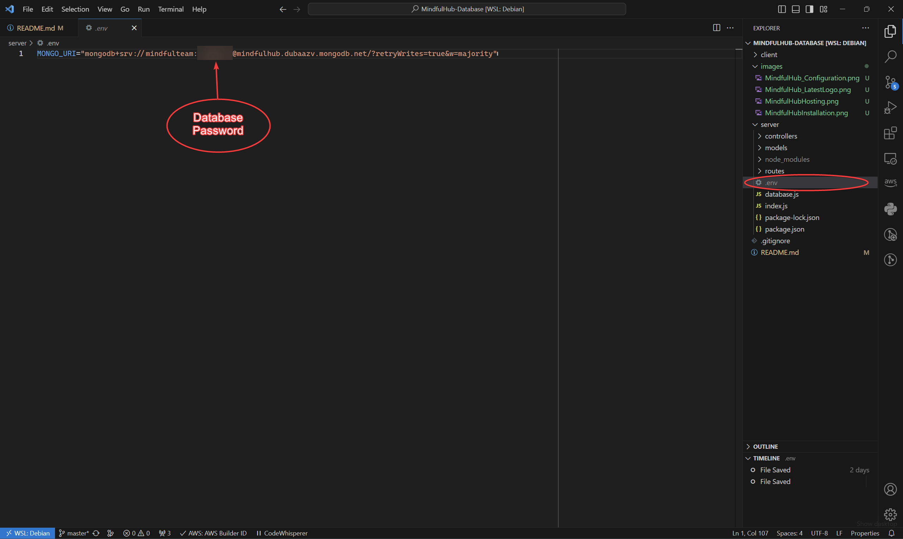

<div align="center">
  
  <h1>MindfulHub</h1>
</div>

MindfulHub is a secure online space for individuals to connect, share experiences, and access peer support and resources for mental health and well-being. The platform prioritizes user engagement through a seamless User Registration and Login Process. Upon registration, users are directed to the Assessment page.

## Hosting

The MindfulHub website is currently hosted on Vercel for the frontend and Render for the backend. Access the live version here.

- [Live Version](https://mindful-hub-database.vercel.app/)



## Installation & Usage

To run the project locally, follow these steps:

1. Clone the repository:
   ```bash
   git clone https://github.com/SwarabRaul/MindfulHub-Database
   ```

2. Install dependencies:
    ```bash
    cd MindfulHub-Database/client
    npm install
    ```
    ```bash
    cd MindfulHub-Database/server
    npm install
    ```

3. Open two separate terminals:
    - In the first terminal, navigate to the client folder and run:

        ```bash
        npm run dev
        ```
    - In the second terminal, navigate to the server folder and run:

        ```bash
        npm start
        ```


## Configuration

The server requires a MongoDB_URI variable. Create a .env file inside the server folder and set the variable MONGO_URI with your MongoDB Atlas drive link.

```bash
MONGO_URI=your-mongodb-uri
```




## Tech Stack

MindfulHub utilizes the following technologies:

- **Vite:**
  - Vite is chosen as the frontend build tool for MindfulHub. Its fast development server, efficient bundling, and support for modern JavaScript features contribute to a smooth and optimized development experience.

- **React:**
  - The frontend of MindfulHub is built with React, a widely adopted JavaScript library for building user interfaces. React's component-based architecture and virtual DOM contribute to a modular and efficient development process.

- **CSS:**
  - Cascading Style Sheets (CSS) are employed for styling the user interface, providing a visually appealing and responsive design. CSS allows for the customization and theming of the platform to enhance the user experience.

- **Express:**
  - The backend of MindfulHub is powered by Express, a popular and minimalistic Node.js web application framework. Express is known for its simplicity and flexibility, making it suitable for building robust and scalable server-side applications.

- **MongoDB:**
  - MindfulHub uses MongoDB as the database to store and manage user data. MongoDB's flexibility and scalability make it well-suited for handling dynamic and evolving data in a mental health and well-being platform.

- **Other Technologies:**
  - MindfulHub incorporates other technologies to enhance functionality, security, and development efficiency. These may include libraries, frameworks, and tools that contribute to the overall success of the platform.

The chosen tech stack reflects our commitment to creating a secure, user-friendly, and scalable platform for supporting mental health and well-being.

## Contributors

We want to thank the following contributors who have helped make MindfulHub better:

| **Name**               | **Email**                                    |
|------------------------|----------------------------------------------|
| Swarab Raul            | [swarab.raul@gmail.com](mailto:swarab.raul@gmail.com)         |
| Yug                    | [yug@gmail.com](mailto:yug@gmail.com)                       |
| Shaurya Shekhar        | [shaurya.shekhar07s@gmail.com](mailto:shaurya.shekhar07s@gmail.com) |
| Vineetha Mary Mathews  | [vineethamathews1234@gmail.com](mailto:vineethamathews1234@gmail.com) |
| Deepti Kademani        | [deeptik0531@gmail.com](mailto:deeptik0531@gmail.com)         |

## Contributing

We welcome and encourage contributions from the community. If you would like to contribute to MindfulHub, please follow these guidelines:

### How to Contribute

1. Fork the repository.
2. Clone your fork to your local machine:

   ```bash
   git clone https://github.com/SwarabRaul/MindfulHub-Database
   ```

3. Create a new branch for your feature or bug fix:

    ```bash
    git checkout -b feature-or-bugfix-branch
    ```

4. Make your changes and commit them:

    ```bash
    git add .
    git commit -m "Your descriptive commit message"
    ```

5. Push your changes to your fork:

    ```bash
    git push origin feature-or-bugfix-branch
    ```

6. Create a pull request (PR) from your fork to the master branch of the original repository. Be sure to provide a detailed description of your changes.

### Development Guidelines

Follow the existing code style and structure.
Write clear and concise commit messages.
Test your changes thoroughly before submitting a pull request.
Ensure your changes do not introduce linting errors or warnings.

## Report Issues

If you encounter any issues or have suggestions, please [create a GitHub issue](https://github.com/SwarabRaul/MindfulHub-Database/issues) to report them. We appreciate your feedback!

## 📬 Contact

If you have any inquiries or issues, please don't hesitate to reach out. We're here to help!

| **Name**               | **Email**                                    |
|------------------------|----------------------------------------------|
| Swarab Raul            | [swarab.raul@gmail.com](mailto:swarab.raul@gmail.com)         |
| Yug                    | [yug@gmail.com](mailto:yug@gmail.com)                       |
| Shaurya Shekhar        | [shaurya.shekhar07s@gmail.com](mailto:shaurya.shekhar07s@gmail.com) |
| Vineetha Mary Mathews  | [vineethamathews1234@gmail.com](mailto:vineethamathews1234@gmail.com) |
| Deepti Kademani        | [deeptik0531@gmail.com](mailto:deeptik0531@gmail.com)         |
